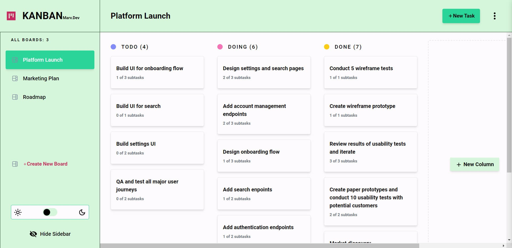
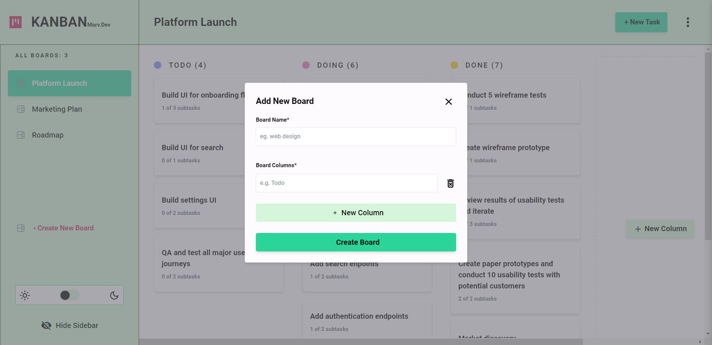
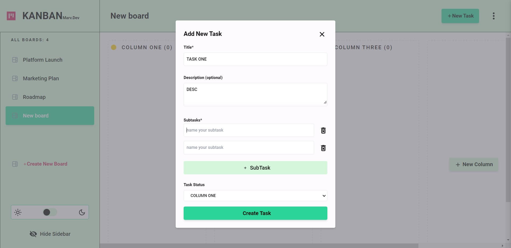
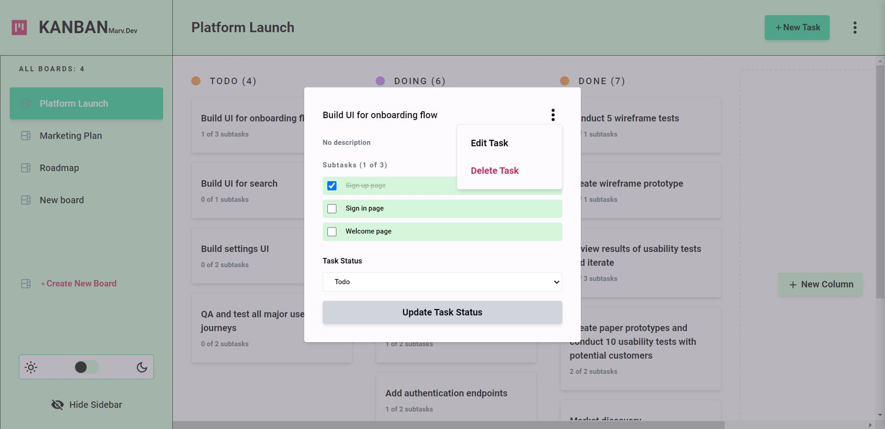
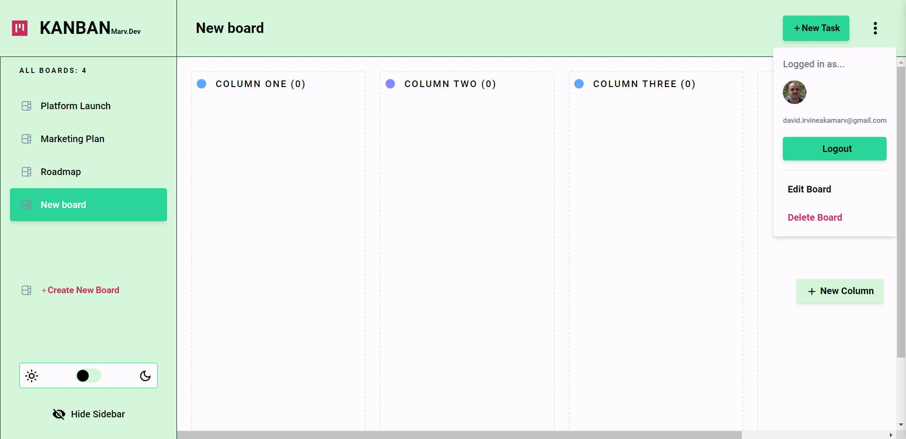

# Kanban - Agile Task Management App

An agile project management app designed to help visualize work, limit work-in-progress, and maximize efficiency (or flow).


Built with [React](https://react.dev/) and [Vite](https://vitejs.dev/). [Firebase](https://firebase.google.com/) for authentication, data storage and retrieval. [Redux Toolkit](https://redux.js.org/) for state management. [ReactDnD](https://react-dnd.github.io/react-dnd/about) handles task drag and drop. Styled with [TailwindCSS](https://tailwindCSS.com).


Tech: 

  
  
  

 ## To get started

If you want to improve upon this project just fork the repo add your code then submit a pull request. If you'd rather a local copy, just clone the repo, open a terminal and run the following:

```bash
npm install
# then run the dev server
npm run dev
# or
yarn dev
# or
pnpm dev
```
Open localhost to see the Kanban app.


## Kanban Screenshots

### Kanban



### Create New Board
This is the view you begin with. Click "Create New Board" in the side menu to get started. Create the new board, name it and then add however many columns your might need. You can always add columns later...



### Add Task 
To populate columns with tasks click "+ New Task". Complete the form by giving the task a title, a description (optional); each task can be composed of a maximum of 5 subtasks. Select a column to place your task. Click "Create Task".



### Edit Task 
Clicking on a task will open the edit menu. Here subtasks can be checked as completed, the task can be deleted or moved into a new column. Check "Update Task" to complete actions. 




### Delete Board/ Sign In 
Clicking on the ellipses menu in the upper right will open the sign in option; currently Google is the only option available. Boards can also be deleted from this menu. 




### Drag n Drop
Tasks can be reordered in column or between columns. Simple click and hold a task and move it to the desired position. The reordered task state will persist. 

